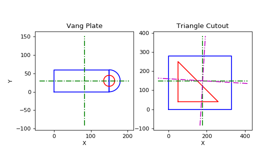

# XSect


[](https://travis-ci.com/mpewsey/xsect)
[](https://xsect.readthedocs.io/en/latest/?badge=latest)
[](https://codecov.io/gh/mpewsey/xsect)

## About
This package contains tools for calculating structural member cross sectional
properties in Python. In addition, it contains a SQLite database of standard
cross sectional properties for which data can be acquired via query functions
or instantiated directly into a new `CrossSection` object.

Calculable cross sectional properties include:

* Cross sectional area
* Centroid
* Second moment of the area (moment of inertia)
* Radius of gyration
* Section modulus
* Principal angles
* Values about the principal axes for the above properties

Composite sections that consist of multiple shapes are also supported, such as those shown below. Here, the shapes shown in blue are added to the cross section, while those shown in red are subtracted cutouts.




## Installation
The package may be installed via `pip` by running the below command:

```
pip install xsect
```


## Examples Usages
The following sections outline some possible uses for this package.


### Quick Access to Properties
Whether you are performing quick calculations, perhaps through the use of
a Jupyter notebook, or a more complex calculation, you can use `XSect` to
reduce the amount of input required for calculations. Rather than turning
to references to lookup and manually input properties for members, you
can create cross sections simply by passing the name of the member into
the appropriate initializer. For example:

```
>>> xsect.CrossSection.from_aisc('L8x8x1-1/8')
CrossSection(name='L8X8X1-1/8', area=16.8, ...)
```


If a property is not contained in the database, you can rapidly calculate
the properties given a series of (x, y) boundary points or use one of the
built-in cross section summary functions to calculate the properties
for a specific shape. For example:

```
>>> odict = xsect.cruciform_summary(8, 8, 1.125)
>>> odict
{'area': 66.9375,
 'x': 0.0,
 'y': 0.0,
 'width': 16.0,
 'height': 16.0,
 'inertia_x': 781.0517578125,
 'inertia_y': 781.0517578125,
 'inertia_j': 1562.103515625,
 'inertia_xy': 0.0,
 'inertia_z': 781.0517578125,
 'gyradius_x': 3.415900115553699,
 'gyradius_y': 3.415900115553699,
 'gyradius_z': 3.415900115553699,
 'elast_sect_mod_x': 97.6314697265625,
 'elast_sect_mod_y': 97.6314697265625,
 'elast_sect_mod_z': 97.6314697265625}
```


This can be used to quickly generate a cross section by unwrapping the
dictionary within the `CrossSection` initializer:

```
>>> xsect.CrossSection('4L8x8x1.125', **odict)
CrossSection(name='4L8x8x1.125', area=66.9375, ...)
```

### Design Optimization
If you are creating a Python application for analyzing and optimizing
structures, you could use `XSect` to pull various cross sections from the
standard sections database to perform analysis via an iterative scheme.
You could also calculate some required properties for the member and use
a database filter to acquire the lightest cross section of a particular shape
given that criteria. For example, if you were designing a member for a known
maximum tensile force, you could calculate its required cross sectional area
and perform a filter similar to the below to get the lightest member:

```
>>> xsect.filter_aisc(["type='L'", 'area>28'], order=['unit_weight'])
  type          name T_F  unit_weight  area     d
0    L  L12X12X1-1/4   F         96.4  28.4  12.0
1    L  L12X12X1-3/8   F        105.0  31.1  12.0
```

This returns a data frame of all "L" shape sections with areas greater
than 28 in ascending order of unit weight. The first row is, naturally,
the lightest member available meeting those conditions.

Likewise, if you are designing a brand new cross section, you could use
one of the provided shape functions or create your own custom function
to generate its boundary points, then calculate the requisite properties
for your design.

## Database Sources

The properties contained in the SQLite database are acquired from the following
sources:

### AISC Shapes

The database includes steel shapes from the American Institute of Steel
Construction (AISC), which were taken from the below publicly available
locations. For variable descriptions, please consult the README included
with their data.

* [AISC Shapes Database v15.0](https://www.aisc.org/globalassets/aisc/manual/v15.0-shapes-database/aisc-shapes-database-v15.0.xlsx)
